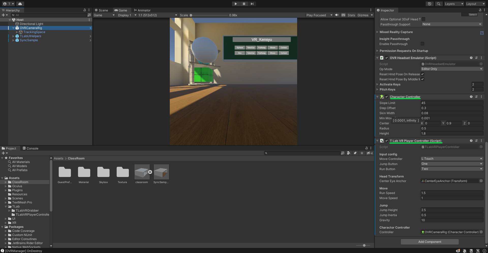

# TLabVRPlayerController
Player Controller for UnityVR  
- Use Character Controller (less rattling when bumping into walls)  
- Simple and intuitive operation

## Screenshot
[Image is an example of a project using this asset](https://github.com/TLabAltoh/VR_Kensyu)  
  

## Getting Started
### Prerequisites
- Unity 2021.3.23f1  
- Oculus Integration (Install from asset store)  
### Installing
Clone the repository to any directory under Assets in the Unity project that will use the assets with the following command  
```
git clone https://github.com/TLabAltoh/TLabVRPlayerController.git
```
If you are adding to an existing git project, use the following command instead
```
git submodule add https://github.com/TLabAltoh/TLabVRPlayerController.git
```
### Set up
  
Attach Charactor Controller and TLabVRPlayerController to OVRCameraRig in Oculus Integration
## Link
- [Sample project using this asset](https://github.com/TLabAltoh/VR_Kensyu)
