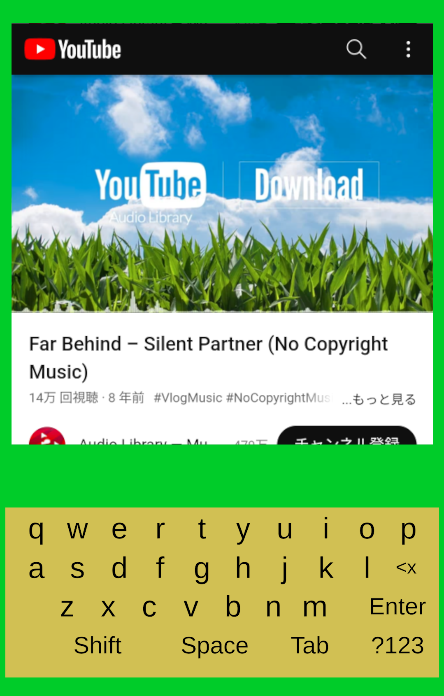
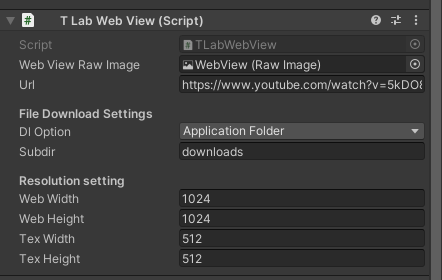

# TLabWebView  

Unityで動作するWebViewのプラグイン．WebViewの結果をTexture2Dとして表示できます  
- ハードウェアアクセラレーションによる描画も取得可能  
- キーボード入力をサポート  
- ファイルのダウンロードをサポート  
- javascriptの実行に対応  

[](https://www.buymeacoffee.com/tlabaltoh)

## Note
- 現在，Unity 2021 ~ 2022を正式にサポートしています．

## スクリーンショット  
Android13, Adreno 619で実行した画面  





## 動作環境
OS: Android 10 ~ 13  
GPU: Qualcomm Adreno 505, 619  
Unity: 2021.23f1  

## スタートガイド
### 必要な要件
- Unity 2021.3.23f1  
- [TLabVKeyborad](https://github.com/TLabAltoh/TLabVKeyborad)
### インストール
リポジトリをクローン，またはリリースからダウンロードし，UnityのAssetフォルダに配置してください
### セットアップ
1. Build Settingsからプラットフォームを Androidに変更  
2. Project Settings --> Player --> Other Settings に以下のシンボルを追加(ビルド時に使用)
```
UNITYWEBVIEW_ANDROID_USES_CLEARTEXT_TRAFFIC
```
```
UNITYWEBVIEW_ANDROID_ENABLE_CAMERA
```
```
UNITYWEBVIEW_ANDROID_ENABLE_MICROPHONE
```
- Color Space: Linear
- Graphics: OpenGLES3
- Minimux API Level: 26 
- Target API Level: 30 (Unity 2021), 31 ~ 32 (Unity 2022)
  
3. TLabWebView/TLabWebView.prefab をシーンに追加
4. WebViewの設定を変更
TLabWebView.cs の設定項目(TLabWebView.prefab/WebView にある)  

  

- Url: WebViewの初期化時にロードするURL  
- DlOption: ファイルをアプリケーションフォルダとダウンロードフォルダどちらにダウンロードするか  
- SubDir: アプリケーションフォルダにダウンロードする場合，```{Application folder}/{files}/{SubDir}```にダウンロードされる  
- Web (Width/Height): WebViewの解像度 (デフォルト 1024 * 1024)  
- Tex (Width/Height): Texture2Dの解像度 (デフォルト 512 * 512)  

## Scripting API
### Initialize
- public void Init(int webWidth, int webHeight, int tWidth, int tHeight, int sWidth, int sHeight, string url, int dlOption, string subDir)
- public bool IsInitialized()
- public void StartWebView()
### Update Frame
- public byte[] GetWebTexturePixel() <span style="color: red; ">(obsolete)</span>
- public IntPtr GetTexturePtr()
- public void UpdateFrame()
### Capture Element
- public void CaptureHTMLSource()
- public void CaptureElementById(string id)
- public string CurrentHTMLCaptured()
### Load URL
- public void LoadUrl(string url)
- public void LoadHTML(string html, string baseURL)
- public void GoForward()
- public void GoBack()
### Zoom In/Out
- public void ZoomIn()
- public void ZoomOut()
### User Agent
- public void CaptureUserAgent()
- public string GetUserAgent()
- public void SetUserAgent(string ua, bool reload)
### Evaluate Javascript
- public void EvaluateJS(string js)
### Touch Event
- public void TouchEvent(int x, int y, int eventNum)
### Key Event
- public void KeyEvent(char key)
- public void BackSpace()
### Clear Cache
- public void ClearCache(bool includeDiskFiles)
- public void ClearCookie()
- public void ClearHistory()

## お知らせ
- VRでのプレイに対応しました([link](https://github.com/TLabAltoh/TLabWebViewVR))

## リンク
[使用したJavaプラグインのソースコード](https://github.com/TLabAltoh/TLabWebViewPlugin)
