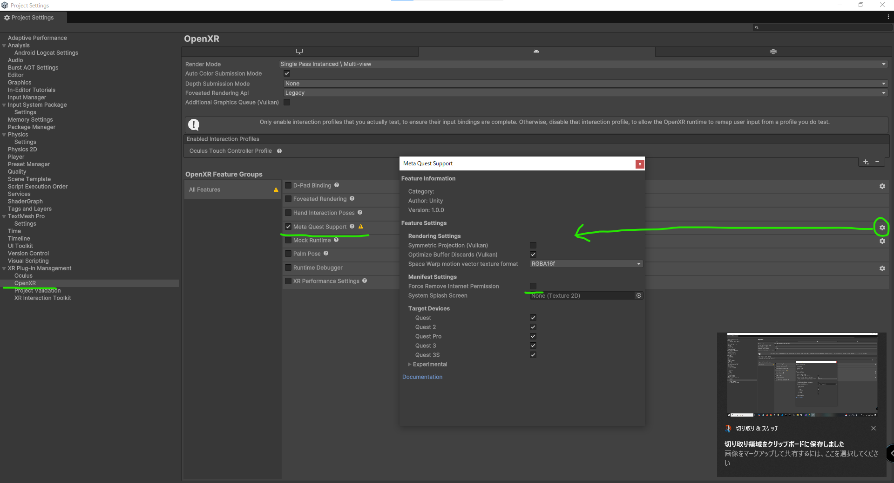

# TLabWebViewVR  

[```TLabWebView```](https://github.com/TLabAltoh/TLabWebView) (3D ウェブブラウザ / 3D WebView プラグイン) を OculusQuest で使用するためのサンプルUnityプロジェクト．[```Meta XR SDK```](https://developers.meta.com/horizon/downloads/package/meta-xr-sdk-all-in-one-upm) と [```XR Interaction Toolkit```](https://docs.unity3d.com/Packages/com.unity.xr.interaction.toolkit@3.0/manual/index.html) それぞれで実装したサンプルが内包されています．

[ドキュメントはこちら](https://tlabgames.gitbook.io/tlabwebview)  
[スニペットはこちら](https://gist.github.com/TLabAltoh/e0512b3367c25d3e1ec28ddbe95da497#file-tlabwebview-snippets-md)  

[](https://www.buymeacoffee.com/tlabaltoh)

> [!WARNING]
> このプロジェクトはAndroidデバイス上でのみ動作します．Unity Editor上で実行してもWebページは表示されないことに注意してください．

> [!WARNING]
> Meta XR All-in-One SDK がバージョン74から参照エラーを起こしているようなので，今のところはバージョン72をキープしています (これについて言及されている[フォーラム](https://www.reddit.com/r/oculusdev/comments/1jn4l5k/error_implementing_meta_allinone_sdk/)).

> [!WARNING]
> 今のところ，このプロジェクトをUnity 6000.xでビルドするのは，動作が不安定のため推奨しません．もしする場合は，セットアップセクションの"Unity 6000.x向けの設定"という項目を参考にしてください．

> [!WARNING]
> このプロジェクトは，WebViewの`CaptureMode`にデフォルトで`HardwareBuffer`を使用しています．この`HardwareBuffer`オプションは，Oculus Questでは動作を確認していますが，他の一部のデバイスでは動かない可能性があります (例えばWebViewの画面が真っ白になってしまう等)．その場合，`CaptureMode`を`HardwareBuffer`から`ByteBuffer`に変更してください．.
>
> <details>
> </img><br>
> </img>
> </details>

## スクリーンショット  

[Watch on Youtube](https://youtu.be/q3swlSP1mRg)  


## 動作環境
|         |                     |
| ------- | ------------------- |
| Headset | Oculus Quest 2      |
| GPU     | Qualcomm Adreno 650 |
| Unity   | 2021.37f1           |

## スタートガイド
### 必要なもの
- Unity 2021.3.26f1 (```meta-xr-sdk``` が Unity Editor 2021.26f1以降を必要とします)  
- [meta-xr-all-in-one-sdk](https://assetstore.unity.com/packages/tools/integration/meta-xr-all-in-one-sdk-269657?locale=ja-JP)
- [com.unity.xr.interaction.toolkit](https://docs.unity3d.com/Packages/com.unity.xr.interaction.toolkit@3.0/manual/index.html)
- [TLabVKeyborad](https://github.com/TLabAltoh/TLabVKeyborad)
- [TLabWebView](https://github.com/TLabAltoh/TLabWebView)

### インストール
- 任意のディレクトリに以下のコマンドでリポジトリをクローン
```
git clone https://github.com/TLabAltoh/TLabWebViewVR.git
	
cd TLabWebViewVR
	
git submodule update --init
```

### セットアップ
[こちら](https://github.com/TLabAltoh/TLabWebView/blob/master/README-ja.md#%E3%82%BB%E3%83%83%E3%83%88%E3%82%A2%E3%83%83%E3%83%97)のセットアップセクションを参照してください

<details><summary>OpenXRを使用する場合</summary>

XR Plugin Manegementから`Force Remove Internet Permission`を無効にしてください．

</img>

</details>

<details><summary>Unity 6000.x向けの設定</summary>

このプロジェクトをUnity 6000.xで開くと，TMProのリソースでコンパイルエラーが発生します．これを解消するために，TMProのリソースを再度インポートしてください．

</img>  

また，`CaptureMode`を，デフォルトの`HardwareBuffer`から`ByteBuffer`に変更してください．

</img>  
</img>

</details>

### サンプルシーン

#### Meta XR SDK
```Assets/TLab/TLabWebViewVR/MetaXR/Samples/Scenes/MetaXR Sample.unity```


#### XR Interaction Toolkit
```Assets/TLab/TLabWebViewVR/XRInteractionToolkit/Samples/Scenes/XRInteractionToolkit Sample.unity```

## サンプルリポジトリ for Unity 2022
- [Oculus Integration Sample](https://github.com/TLabAltoh/TLabWebViewVR-OculusIntegration-2022)
- [XR Interaction Toolkit Sample (VR Template)](https://github.com/TLabAltoh/TLabWebViewVR-XRInteractionToolkit-2022)
