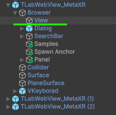
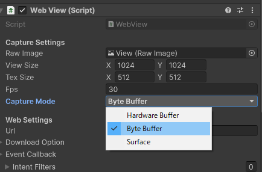

# TLabWebViewVR

[日本語版READMEはこちら](README-ja.md)

Sample Unity project for using [```TLabWebView```](https://github.com/TLabAltoh/TLabWebView) (3D web browser / 3D WebView plugin) in OculusQuest. Includes [```Meta XR SDK```](https://developers.meta.com/horizon/downloads/package/meta-xr-sdk-all-in-one-upm) and [```XR Interaction Toolkit```](https://docs.unity3d.com/Packages/com.unity.xr.interaction.toolkit@3.0/manual/index.html) implementation example.

[Document is here](https://tlabgames.gitbook.io/tlabwebview)  
[Snippets is here](https://gist.github.com/TLabAltoh/e0512b3367c25d3e1ec28ddbe95da497#file-tlabwebview-snippets-md)  

[](https://www.buymeacoffee.com/tlabaltoh)

> [!WARNING]
> Note that this project only works on Android devices; it will not display web pages when run on the Unity Editor.

> [!WARNING]
> Meta XR All-in-One SDK is having a reference error at version 74 (Please see [this forum](https://www.reddit.com/r/oculusdev/comments/1jn4l5k/error_implementing_meta_allinone_sdk/)), so I will keep version 72 for now.

> [!WARNING]
> For now, I do not recommend building this project with Unity 6000.x due to unstable. If you do, please refer to the "Configuration for Unity 6000.x" section in the Setup section.

## Screenshot  
[Watch on Youtube](https://youtu.be/q3swlSP1mRg)  


## Operating Environment
|         |                     |
| ------- | ------------------- |
| Headset | Oculus Quest 2      |
| GPU     | Qualcomm Adreno 650 |
| Unity   | 2021.37f1           |

## Getting Started
### Prerequisites
- Unity 2021.26f1 (meta xr sdk requires Unity Editor 2021.26f1 ~)
- [meta-xr-all-in-one-sdk](https://assetstore.unity.com/packages/tools/integration/meta-xr-all-in-one-sdk-269657?locale=ja-JP)
- [com.unity.xr.interaction.toolkit](https://docs.unity3d.com/Packages/com.unity.xr.interaction.toolkit@3.0/manual/index.html)
- [TLabVKeyborad](https://github.com/TLabAltoh/TLabVKeyborad)
- [TLabWebView](https://github.com/TLabAltoh/TLabWebView)

### Installing
- Clone the repository with the following command
```
git clone https://github.com/TLabAltoh/TLabWebViewVR.git

cd TLabWebViewVR

git submodule update --init
```

### Set Up
Please see the setup section [here](https://github.com/TLabAltoh/TLabWebView?tab=readme-ov-file#set-up)

<details><summary>When using the OpenXR plugin</summary>

Please disable `Force Remove Internet Permission` from XR Plugin Manegement

</img>

</details>

<details><summary>Configuration for Unity 6000.x</summary>

When opening this project in Unity 6000.x, a compile error occurs in the TMPro resource. To resolve this, re-import the TMPro resources.

</img>  

Also, please change the capture mode from the default `HardwareBuffer` to `ByteBuffer`.

</img>  
</img>

</details>

### Sample Scene

#### Meta XR SDK
```Assets/TLab/TLabWebViewVR/MetaXR/Samples/Scenes/MetaXR Sample.unity```

#### XR Interaction Toolkit
```Assets/TLab/TLabWebViewVR/XRInteractionToolkit/Samples/Scenes/XRInteractionToolkit Sample.unity```

## Sample Repository for Unity 2022
- [Oculus Integration Sample](https://github.com/TLabAltoh/TLabWebViewVR-OculusIntegration-2022)
- [XR Interaction Toolkit Sample (VR Template)](https://github.com/TLabAltoh/TLabWebViewVR-XRInteractionToolkit-2022)
